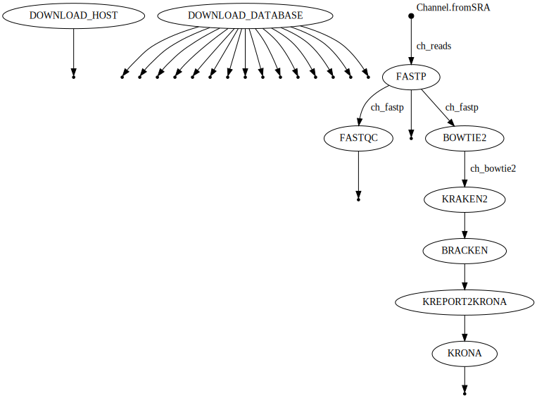
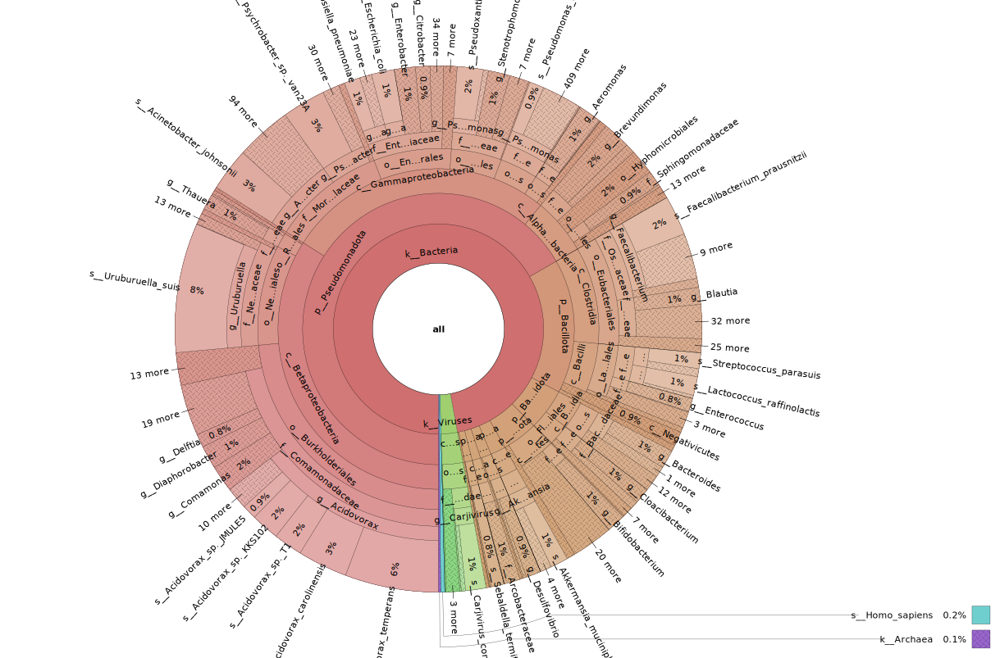

# Taxonomic Classification and Visualization of Short-Read Metagenomic Sequencing Data
### By: Amos Fong

***

## Background and Rationale

Global genomic pathogen surveillance is an important public health initiative, that enables public health scientists to identify and respond to the emergence of pathogenic strains. Monitoring urban sewage offers a pragmatic approach to genomic pathogen surveillance, enabling scientists to study the epidemiological underpinnings of the selection and evolution of pathogenic strains, as well as antibiotic resistance genes [[1]](#1)[[2]](#2)[[3]](#3). Urban sewage, as a sampling medium, provides a comprehensive snapshot of the microbiological contributions from both local humans and animals, as well as contributions from the immediate environment. Importantly, sampling urban sewage does not require obtaining participant consent for collecting human fecal samples and bypasses the laborious effort of assembling a cohort large enough to generalize findings to the population level.

Shotgun metagenomics sequencing offers a high-throughput and unbiased approach to capturing the complex genetic diversity inherent in environmental samples, such as urban sewage. A key step in the analysis of metagenomic sequencing data is taxonomic profiling, which involves examining sequencing reads to infer the microbial makeup of the sample. Among the bioinformatic tools currently available for taxonomic classification, Kraken and its derivative tools (Bracken and Kraken2) stand out as some of the best-performing tools in terms of computational requirements and performance accuracy [[4]](#4)[[5]](#5)[[6]](#6)[[7]](#7). Furthermore, the inherent uncertainty in taxonomic classifications underscores the importance of considering their hierarchical contexts and prediction confidence scores when visualizing metagenomic data. Krona represents an attractive solution for metagenomic data visualization, as it captures both the quantitative hierarchical relationships between bacterial species and enables the visualization of secondary metadata variables [[8]](#8).

Here, we present a bioinformatics workflow that performs end-to-end quality control, read pre-processing, host decontamination, taxonomic classification, abundance estimation, and interactive visualization for short-read metagenomics sequencing data. We anticipate that this workflow will offer a comprehensive solution for querying and analyzing metagenomics sequencing data from publicly available FASTQ files deposited in the NCBI Sequence Read Archive (SRA). The design of this workflow was inspired by the nf-core [taxprofiler]( https://github.com/nf-core/taxprofiler) pipeline.

This workflow begins by downloading and unpacking the [Bowtie2 database](https://genome-idx.s3.amazonaws.com/bt/GRCh38_noalt_as.zip) of the human host genome GRCh38 (hg38) and the [Kraken 2 / Bracken RefSeq indexes](https://genome-idx.s3.amazonaws.com/kraken/k2_standard_08gb_20231009.tar.gz) (Standard-8 collection). Next, the workflow loads in raw metagenomic sequencing data in FASTQ format from the NCBI SRA. For the purposes of modelling this workflow, we will be analyzing sequencing results from a urban sewage sample collected in Vancouver, BC. Subsequently, the workflow utilizes [FASTP](https://github.com/OpenGene/fastp) to perform read pre-processing [[9]](#9). FASTP is a tool designed to provide a fast all-in-one preprocessing step for FASTQ files. The workflow then uses [FASTQC](https://www.bioinformatics.babraham.ac.uk/projects/fastqc/) to generate read quality reports, providing a summary of the FASTQ read quality after FASTP pre-processing. In parallel, [Bowtie2](https://github.com/BenLangmead/bowtie2) is used to remove reads mapping to the hg38 genome found in the FASTP pre-processed reads [[10]](#10). Following these steps, the workflow uses [Kraken2](https://github.com/DerrickWood/kraken2) to assign taxonomic labels to the Bowtie2-filtered, FASTP pre-processed reads[[6]](#6). Subsequently, [Braken](https://github.com/jenniferlu717/Bracken) is used to estimate the taxonomic abundances at the species level using the Kraken2-assigned taxonomy classes[[5]](#5). The workflow then uses the the python script `kreport2krona.py` from [KrakenTools](https://github.com/jenniferlu717/KrakenTools) to convert the Kraken2/Bracken report into a Krona-compatible text file [[11]](#11). Finally, the workflow uses [Krona](https://github.com/marbl/Krona/wiki) to generate a HTML file which provides an interactive visualization of the estimated taxonomical abundances [[8]](#8).



## SOP
### Dependencies
To run this workflow, the user must have [docker](https://docs.docker.com/engine/install/), [git](https://git-scm.com/book/en/v2/Getting-Started-Installing-Git) and [conda](https://docs.conda.io/projects/conda/en/latest/user-guide/install/index.html) installed. 

This workflow installs the following packages:
```
bowtie2=2.5.2
bracken=2.9
fastp=0.23.4
fastqc=0.12.1
kraken2=2.1.3
krakentools=1.2
krona=2.8.1
nextflow=23.10.0
```

This workflow uses the following containers:
- fastp(`nanozoo/fastp:latest`)
- FastQC(`staphb/fastqc:latest`)
- Krona(`nanozoo/krona:latest`)

### Installation
Step 1: Deactivate conda environment
```
conda deactivate
```
Step 2: Navigate to home directory
```
cd ~
```
Step 3: Clone repository
```
git clone https://github.com/AmosFong1/BIOF501A
```
Step 4: Navigate to project directory
```
cd BIOF501A
```
Step 5: Create conda environment
```
conda env create -f environment.yml
```
Step 6: Activate conda environment
```
conda activate BIOF501A
```
Step 7: Clone KrakenTools repository
```
git clone https://github.com/jenniferlu717/KrakenTools
```
Step 8: Remove sym link
```
rm -rf ~/.conda/envs/BIOF501A/opt/krona/taxonomy
```
Step 9: Create directory to store new krona database
```
mkdir -p krona/taxonomy
```
Step 10: Create sym link to new krona database
```
ln -s ~/BIOF501A/krona/taxonomy ~/.conda/envs/BIOF501A/opt/krona/taxonomy
```
Step 11: Download new krona database
```
wget -pO krona/taxonomy/taxdump.tar.gz https://ftp.ncbi.nih.gov/pub/taxonomy/taxdump.tar.gz
```
Step 12: Run `ktUpdateTaxonomy.sh` script
```
ktUpdateTaxonomy.sh --only-build
```
### Usage
Step 1: Activate conda environment
```
conda activate BIOF501A
```
Step 2: Run the workflow (use `-resume` option as needed)
```
nextflow run BIOF501A.nf
```

## Input
The workflow inputs include raw metagenomic sequencing data (FASTQ) from a global sewage-based antimicrobial resistance (AMR) profiling project. The original analysis was published in a paper titled "Genomic analysis of sewage from 101 countries reveals global landscape of antimicrobial resistance"[[1]](#1). The FASTQ files generated from this study can be accessed at the European Nucleotide Archive under accession numbers [PRJEB40798](https://www.ebi.ac.uk/ena/browser/view/PRJEB40798), [PRJEB40816](https://www.ebi.ac.uk/ena/browser/view/PRJEB40816), [PRJEB40815](https://www.ebi.ac.uk/ena/browser/view/PRJEB40815), [PRJEB27621](https://www.ebi.ac.uk/ena/browser/view/PRJEB27621), [PRJEB51229](https://www.ebi.ac.uk/ena/browser/view/PRJEB51229), and [PRJEB13831](https://www.ebi.ac.uk/ena/browser/view/PRJEB13831). The sample used to model this workflow was collected on 2017-06-23 in Vancouver, BC. The FASTQ files for this sample can be found under study accession [PRJEB27621](https://www.ebi.ac.uk/ena/browser/view/PRJEB27621), sample accession [SAMEA4777410](https://www.ebi.ac.uk/ena/browser/view/SAMEA4777410), experiment accession [ERX2697767](https://www.ebi.ac.uk/ena/browser/view/ERX2697767), and run accession [ERR2683153](https://www.ebi.ac.uk/ena/browser/view/ERR2683153). The other inputs include the [Bowtie2 database](https://genome-idx.s3.amazonaws.com/bt/GRCh38_noalt_as.zip) of the human host genome GRCh38 (hg38) and the [Kraken 2 / Bracken RefSeq indexes](https://genome-idx.s3.amazonaws.com/kraken/k2_standard_08gb_20231009.tar.gz) (Standard-8 collection), which are both downloaded and unpackaged as part of the workflow.

## Output
The workflow's main output is the `krona.html` file, which can be found in the `data/krona` directory. This file provides an interactive metagenomic visualization of estimated taxonomical abundances that can be downloaded and explored with any web browser. The other outputs include the the `fastp_ERR2683153_1_fastqc.html` and `fastp_ERR2683153_2_fastqc.html` files, which can be found in the `data/fastqc` directory. These files provide a QC report of the FASTP-processed reads, which can be downloaded and explored with any web browser.



Here we observe that our sample consists primarily of predicted bacterial-associated sequences, with 3%, 0.2%, and 0.1% of sequences predicted as Viruses, Homo sapiens (after Bowtie2 host decontamination), and Archaea-associated sequences, respectively. Among the bacterial-associated sequences, more than 14000 species have been captured, providing a high-resolution framework for monitoring the population dynamics of specific species. However, Kraken2 failed to assign taxonomic classifications to 65.11% of sequences, as reported in the `data/kraken2/k2_report.txt` file. This is likely due to the pipelines use of the 8GB-capped standard-8 collection for its Kraken2/Bracken RefSeq index. Choosing a more comprehensive [alternative index]( https://benlangmead.github.io/aws-indexes/k2) from their offerings or assembling a customized index from scratch has the potential to improve the sensitivity of Kraken2 classification. Possible explanations for these unclassified Kraken2 sequences include the potential that these reads have not yet undergone characterization within the existing RefSeq databases. Another possibility is that these sequences may originate from taxonomic kingdoms not captured by the standard-8 collection of the Kraken2/Bracken indexes.

## References
<a id="1">[1]</a>
Munk P, Brinch C, Møller FD, et al. Genomic analysis of sewage from 101 countries reveals global landscape of antimicrobial resistance. Nat Commun. 2022;13(1):7251. 

<a id="2">[2]</a>
Hendriksen RS, Munk P, Njage P, et al. Global monitoring of antimicrobial resistance based on metagenomics analyses of urban sewage. Nat Commun. 2019;10(1):1124. 

<a id="3">[3]</a>
Majeed HJ, Riquelme MV, Davis BC, et al. Evaluation of Metagenomic-Enabled Antibiotic Resistance Surveillance at a Conventional Wastewater Treatment Plant. Front. Microbiol. 2021;12:657954. 

<a id="4">[4]</a>
Wood DE, Salzberg SL. Kraken: ultrafast metagenomic sequence classification using exact alignments. Genome Biol. 2014;15(3):R46. 

<a id="5">[5]</a>
Lu J, Rincon N, Wood DE, et al. Metagenome analysis using the Kraken software suite. Nat Protoc. 2022;17(12):2815–2839.

<a id="6">[6]</a>
Wood DE, Lu J, Langmead B. Improved metagenomic analysis with Kraken 2. Genome Biol. 2019;20(1):257. 

<a id="7">[7]</a>
Ye SH, Siddle KJ, Park DJ, Sabeti PC. Benchmarking Metagenomics Tools for Taxonomic Classification. Cell. 2019;178(4):779–794. 

<a id="8">[8]</a>
Ondov BD, Bergman NH, Phillippy AM. Interactive metagenomic visualization in a Web browser. BMC Bioinformatics. 2011;12(1):385. 

<a id="9">[9]</a>
Chen S, Zhou Y, Chen Y, Gu J. fastp: an ultra-fast all-in-one FASTQ preprocessor. Bioinformatics. 2018;34(17):i884–i890. 

<a id="10">[10]</a>
Langmead B, Salzberg SL. Fast gapped-read alignment with Bowtie 2. Nat Methods. 2012;9(4):357–359. 

<a id="11">[11]</a>
Lu J, Rincon N, Wood DE, et al. Metagenome analysis using the Kraken software suite. Nat Protoc. 2022;17(12):2815–2839.
