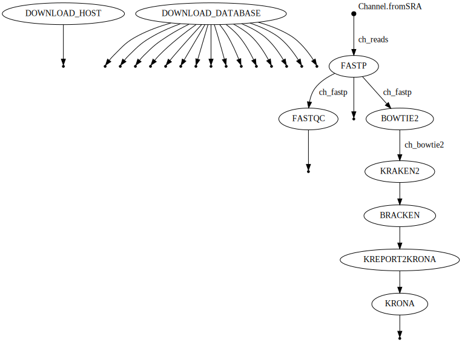
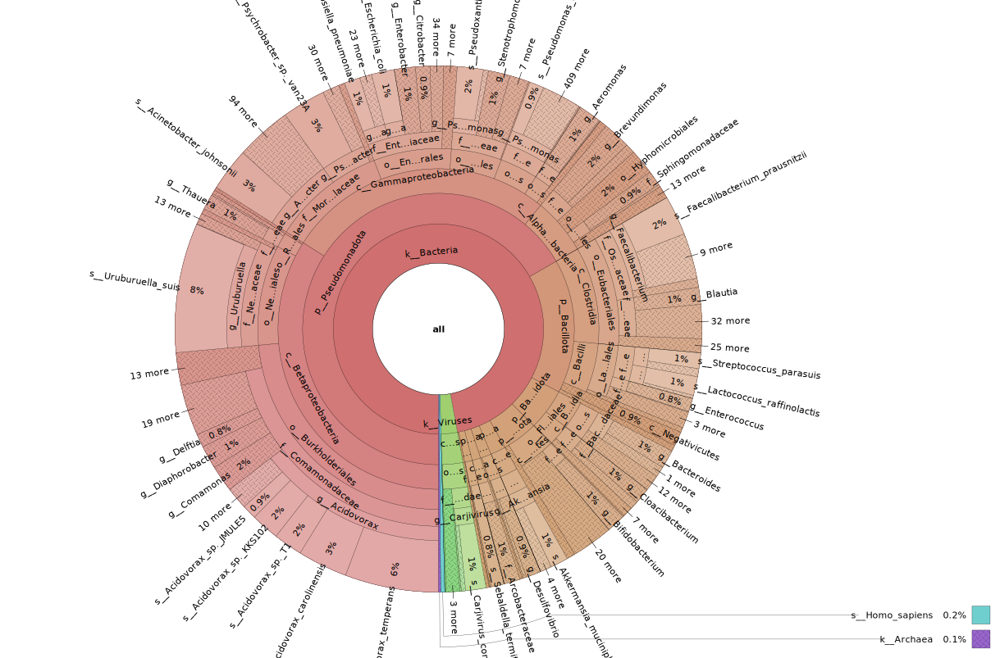

# Taxonomic Classification and Visualization of Short-Read Metagenomic Sequencing Data
### By: Amos Fong

***

## Background and Rationale

The workflow starts by downloading and unpacking the Bowtie2 database of the human host genome GRCh38 (hg38), and the Kraken 2 / Bracken RefSeq indexes (Standard-8 collection). Next, the workflow loads in raw metagenomic sequencing data (FASTQ) from the NCBI sequence read archive (SRA). For the purposes of modelling this workflow, we will be analyzing sequencing results from a urban sewage sample collected in Vancouver, BC. Next, the workflow uses FASTP to perform read pre-processing. FASTP is a tool designed to provide a fast all-in-one preprocessing step for FastQ files. Next, the workflow uses FASTQC to generate read quality reports, which provides a summary of the FASTQ read quality after FASTP pre-processing. In parallel, the workflow uses Bowtie2 to remove reads mapping to the hg38 genome found in the FASTP pre-processed reads. Next, the workflow uses Kraken2 to assign taxonomic labels to the Bowtie2 filtered, FASTP pre-processed reads. Next, the workflow uses Bracken to estimate the taxonomic abundances at the species level using the Kraken2 assigned classes. Next, the workflow uses the the python script `kreport2krona.py` from KrakenTools to convert the Kraken2/Bracken report into a Krona-compatible text file. Finally, the workflow uses Krona to generate an HTML file which provides an interactive visualization of the estimated taxonomical abundances.



## SOP
### Dependencies
To run this workflow, the user must have [git](https://git-scm.com/book/en/v2/Getting-Started-Installing-Git) and [conda](https://docs.conda.io/projects/conda/en/latest/user-guide/install/index.html) installed. Additionally, this workflow depends on the following packages:
```
bowtie2=2.5.2
bracken=2.9
fastp=0.23.4
fastqc=0.12.1
kraken2=2.1.3
krakentools=1.2
krona=2.8.1
nextflow=23.10.0
```
### Installation
Step 1: Deactivate conda environment
```
conda deactivate
```
Step 2: Clone repository
```
git clone https://github.com/AmosFong1/BIOF501A
```
Step 3: Navigate to project directory
```
cd BIOF501A
```
Step 4: Create conda environment
```
conda env create -f environment.yml
```
Step 5: Clone KrakenTools repository
```
git clone https://github.com/jenniferlu717/KrakenTools
```
Step 6: Remove faulty sym link
```
rm -rf "$(pwd)"/.conda/envs/BIOF501A/opt/krona/taxonomy
```
Step 7: Create directory to store new krona database
```
mkdir -p "$(pwd)"/krona/taxonomy
```
Step 8: Create sym link to new krona database
```
ln -s "$(pwd)"/krona/taxonomy "$(pwd)"/.conda/envs/BIOF501A/opt/krona/taxonomy
```
Step 9: Download new krona database
```
wget -pO "$(pwd)"/krona/taxonomy/taxdump.tar.gz https://ftp.ncbi.nih.gov/pub/taxonomy/taxdump.tar.gz
```
Step 10: Run `ktUpdateTaxonomy.sh` script
```
ktUpdateTaxonomy.sh --only-build
```
### Usage
Step 1: Activate conda environment
```
conda activate BIOF501A
```
Step 2: Run the workflow (use `-resume` option as needed)
```
nextflow run BIOF501A.nf
nextflow run BIOF501A.nf -resume
```

## Input
The workflow inputs include raw metagenomic sequencing data (FASTQ) from a global sewage-based antimicrobial resistance (AMR) profiling project. The original analysis was published in a paper titled "Genomic analysis of sewage from 101 countries reveals global landscape of antimicrobial resistance". The FASTQ files generated from this study can be accessed at the European Nucleotide Archive under accession numbers PRJEB40798, PRJEB40816, PRJEB40815, PRJEB27621, PRJEB51229, and ERP015409. The sample used to model this workflow was collected on 2017-06-23 in Vancouver, BC. The FASTQ files for this sample can be found under study accession PRJEB27621, sample accession SAMEA4777410, experiment accession ERX2697767, and run accession ERR2683153. The other inputs include the Bowtie2 database of the human host genome GRCh38 (hg38), and the Kraken 2 / Bracken RefSeq indexes (Standard-8 collection), which are both downloaded and unpackaged as part of the workflow.

## Output
The workflow's main output is the `krona.html` file, which can be found in the `data/krona` directory. This file provides an interactive metagenomic visualization of estimated taxonomical abundances that can be downloaded and explored with any web browser. The other outputs include the the `fastp_ERR2683153_1_fastqc.html` and `fastp_ERR2683153_2_fastqc.html` files, which can be found in the `data/fastqc` directory. These files provide a QC report of the FASTP-processed FASTQ files, which can be downloaded and explored with any web browser.


